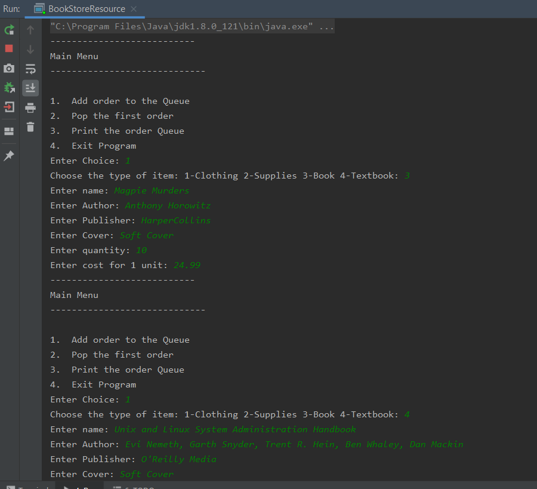
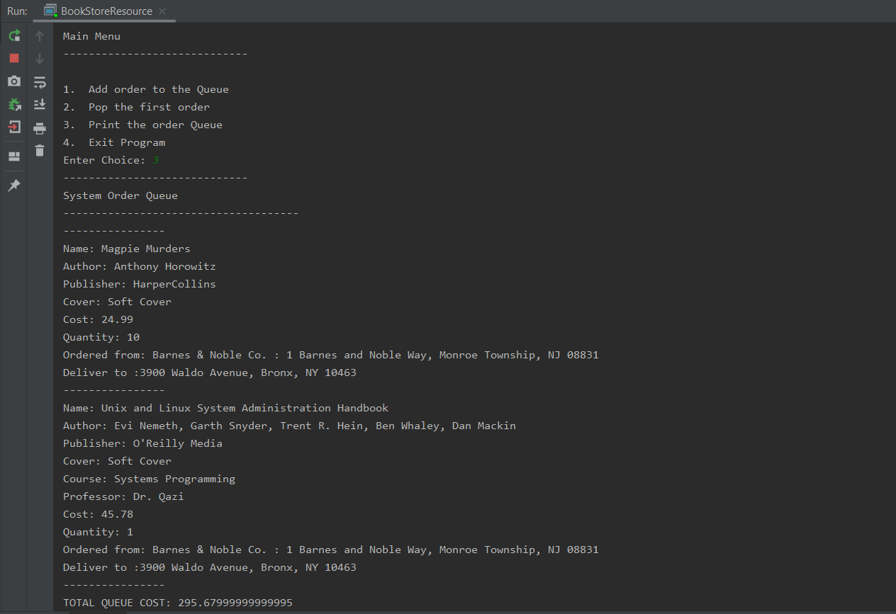

# Objected Oriented Programming with Java: Final Project
****
**Purpose: To showcase understanding of OOP fundamentals including virtual methods, polymorphism, multiple inheritance, etc.**

Description: Our assignment was to create a system that could be used by the school's software, and that shows the understanding of
the OOP fundamentals we had learned in class. I decided to create an order queue that the school bookstore could use to keep track of all inventory
that they either ordered or received.

